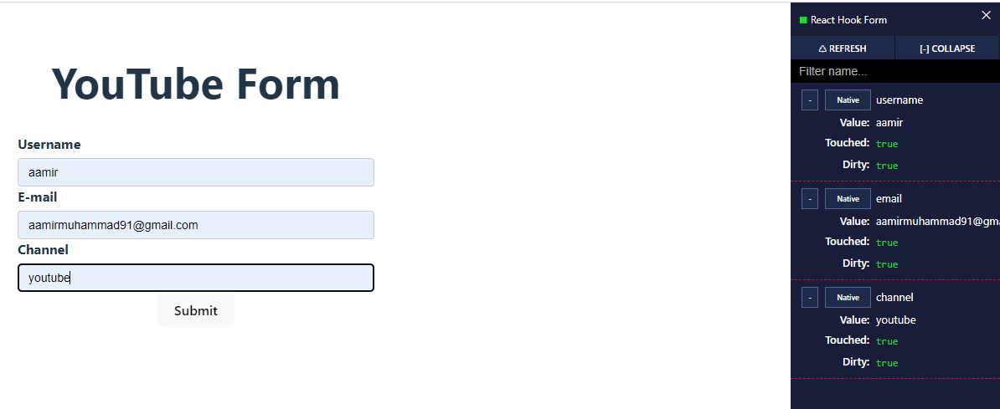

# React Hook Form


### what

A small library that helps deal with forms in React.

### why

- Manage form data
- Submit form data
- Enforce validations
- provide visual feedback

## lecture 2. Form Setup


create react app using vite

```
npm create vite@latest rhf-demo
select framework: react
variant: TypeScript
cd rhf-demo
npm install
npm run dev // to run in develop mode
```

if you want to use CRA

```
npx create-react-app rhf-demo --template typescript
```

add the `YouTubeForm.tsx` component

```
import React from 'react';
export const YouTubeForm = () => {
  return (
    <div>
      <h1>YouTube Form</h1>

      <form>
        <label htmlFor="username">Username</label>
        <input type="text" id="username" name="username" />

        <label htmlFor="email">E-mail</label>
        <input type="email" id="email" name="email" />

        <label htmlFor="channel">Channel</label>
        <input type="text" id="channel" name="channel" />

        <button>Submit</button>
      </form>
    </div>
  );
};
```

## lecture 3. useForm Hook

- install react-hook-form `npm install react-hook-form`.

```
// lecture 3. useForm Hook

import React from 'react';
import { useForm } from 'react-hook-form';
export const YouTubeForm = () => {
  const form = useForm();
  return (
    <div>
      <h1>YouTube Form</h1>

      <form>
        <label htmlFor="username">Username</label>
        <input type="text" id="username" name="username" />

        <label htmlFor="email">E-mail</label>
        <input type="email" id="email" name="email" />

        <label htmlFor="channel">Channel</label>
        <input type="text" id="channel" name="channel" />

        <button>Submit</button>
      </form>
    </div>
  );
};
```

## lecture 4. Managing form state

we can destructure `form` and get the `register` from it. than we can take the 4 methods from `register` as below.

```
// lecture 4. Managing Form State

// either we do like this one by one for each input element
import React from 'react';
import { useForm } from 'react-hook-form';
export const YouTubeForm = () => {
  const form = useForm();
  const {register} = form;
  const {name, ref, onChange, onBlur} = register("username");
  return (
    <div>
      <h1>YouTube Form</h1>

      <form>
        <label htmlFor="username">Username</label>
        <input type="text" id="username" name={name} ref={ref} onChange={onChange} onBlur={onBlur} />

        <label htmlFor="email">E-mail</label>
        <input type="email" id="email" name="email" />

        <label htmlFor="channel">Channel</label>
        <input type="text" id="channel" name="channel" />

        <button>Submit</button>
      </form>
    </div>
  );
};
```

or we simply destructure the `register` method on each input element.

```
// lecture 4. Managing Form State
import React from 'react';
import { useForm } from 'react-hook-form';
export const YouTubeForm = () => {
  const form = useForm();
  const { register } = form;
  return (
    <div>
      <h1>YouTube Form</h1>

      <form>
        <label htmlFor="username">Username</label>
        <input type="text" id="username" {...register('username')} />

        <label htmlFor="email">E-mail</label>
        <input type="email" id="email" {...register('email')} />

        <label htmlFor="channel">Channel</label>
        <input type="text" id="channel" {...register('channel')} />

        <button>Submit</button>
      </form>
    </div>
  );
};
```

## lecture 5. DevTools Visualization

install the `dev tools` using this command

```
npm install -D @hookform/devtools
```

when we import the `DevTool` component and `control` property from form the component will now be like

```
// lecture 5. DevTools Visualization
import React from 'react';
import { useForm } from 'react-hook-form';
import { DevTool } from '@hookform/devtools';
export const YouTubeForm = () => {
  const form = useForm();
  const { register, control } = form;
  return (
    <div>
      <h1>YouTube Form</h1>

      <form>
        <label htmlFor="username">Username</label>
        <input type="text" id="username" {...register('username')} />

        <label htmlFor="email">E-mail</label>
        <input type="email" id="email" {...register('email')} />

        <label htmlFor="channel">Channel</label>
        <input type="text" id="channel" {...register('channel')} />

        <button>Submit</button>
      </form>
      <DevTool control={control} />
    </div>
  );
};
```

then we can visualize the form state.



## lecture 6. Form State and Rerenders

with normal form in react with each input the component and its child components rerenders but with `reac-hook-form` the component is not rerendering which is an important point to remember. to see this we make changes like so. we are dividing by 2 because in strict mode component renders 2 times.

```
// lecture 6. Form State and Rerenders
import React from 'react';
import { useForm } from 'react-hook-form';
import { DevTool } from '@hookform/devtools';

let renderCount = 0;

export const YouTubeForm = () => {
  const form = useForm();
  const { register, control } = form;

  renderCount++;
  return (
    <div>
      <h1>YouTube Form (renderCount: {renderCount / 2})</h1>

      <form>
        <label htmlFor="username">Username</label>
        <input type="text" id="username" {...register('username')} />

        <label htmlFor="email">E-mail</label>
        <input type="email" id="email" {...register('email')} />

        <label htmlFor="channel">Channel</label>
        <input type="text" id="channel" {...register('channel')} />

        <button>Submit</button>
      </form>
      <DevTool control={control} />
    </div>
  );
};
```

## lecture 7. Form Submission

for form submission `useForm` is providing a `handleSubmit` method which need a function as an input here in this case it is `onSubmit`. also for typescript we need to define the type of data.

```
// lecture 7. Form Submission
import React from 'react';
import { useForm } from 'react-hook-form';
import { DevTool } from '@hookform/devtools';

let renderCount = 0;
type FormValues = {
  username: String;
  email: String;
  channel: String;
};

export const YouTubeForm = () => {
  const form = useForm<FormValues>();
  const { register, control, handleSubmit } = form;

  renderCount++;
  const onSubmit = (data: FormValues) => {
    console.log('Form submitted', data);
  };
  return (
    <div>
      <h1>YouTube Form (renderCount: {renderCount / 2})</h1>

      <form onSubmit={handleSubmit(onSubmit)}>
        <label htmlFor="username">Username</label>
        <input type="text" id="username" {...register('username')} />

        <label htmlFor="email">E-mail</label>
        <input type="email" id="email" {...register('email')} />

        <label htmlFor="channel">Channel</label>
        <input type="text" id="channel" {...register('channel')} />

        <button>Submit</button>
      </form>
      <DevTool control={control} />
    </div>
  );
};
```

## lecture 8. Form Validation

React Hook form supports various HTML validation rules

- required
- minLength & maxLength
- min & max
- pattern

so first we will provide `noValidate` attribute on the `form` element which will disable the validation from the browser side. than we will enable the `react-hook-form` to take control of the form validation.

```
// lecture 8. Form Validation
import React from 'react';
import { useForm } from 'react-hook-form';
import { DevTool } from '@hookform/devtools';

let renderCount = 0;
type FormValues = {
  username: String;
  email: String;
  channel: String;
};

export const YouTubeForm = () => {
  const form = useForm<FormValues>();
  console.log(form);
  const { register, control, handleSubmit } = form;

  renderCount++;
  const onSubmit = (data: FormValues) => {
    console.log('Form submitted', data);
  };
  return (
    <div>
      <h1>YouTube Form (renderCount: {renderCount / 2})</h1>

      <form onSubmit={handleSubmit(onSubmit)} noValidate>
        <label htmlFor="username">Username</label>
        <input
          type="text"
          id="username"
          {...register('username', {
            required: {
              value: true,
              message: 'Username is required',
            },
          })}
        />

        <label htmlFor="email">E-mail</label>
        <input
          type="email"
          id="email"
          {...register('email', {
            pattern: {
              value: /^[a-zA-Z0-9.!#$%&'*+/=?^_`{|}~-]+@[a-zA-Z0-9]+(?:\.[a-zA-Z0-9-]+)*$/,
              message: 'Invalid email format',
            },
          })}
        />

        <label htmlFor="channel">Channel</label>
        <input
          type="text"
          id="channel"
          {...register('channel', {
            required: {
              value: true,
              message: 'channel is required',
            },
          })}
        />

        <button>Submit</button>
      </form>
      <DevTool control={control} />
    </div>
  );
};
```

This configuration will give the validation messages only in `DevTool` if we want to surface it for the end users we will do some extra configurations.

## lecture 9. Display Error Messages

for this we will destructure `formState` from `form` and then we destructure `errors` from `formState`. using `errors` we can display the validation messages to the end user.

```
// lecture 9. Display Error Messages
import React from 'react';
import { useForm } from 'react-hook-form';
import { DevTool } from '@hookform/devtools';

let renderCount = 0;
type FormValues = {
  username: String;
  email: String;
  channel: String;
};

export const YouTubeForm = () => {
  const form = useForm<FormValues>();
  console.log(form);
  const { register, control, handleSubmit, formState } = form;
  const { errors } = formState;

  renderCount++;
  const onSubmit = (data: FormValues) => {
    console.log('Form submitted', data);
  };
  return (
    <div>
      <h1>YouTube Form (renderCount: {renderCount / 2})</h1>

      <form onSubmit={handleSubmit(onSubmit)} noValidate>
        <div className="form-control">
          <label htmlFor="username">Username</label>
          <input
            type="text"
            id="username"
            {...register('username', {
              required: {
                value: true,
                message: 'Username is required',
              },
            })}
          />
          <p className="error">{errors.username?.message}</p>
        </div>
        <div className="form-control">
          <label htmlFor="email">E-mail</label>
          <input
            type="email"
            id="email"
            {...register('email', {
              pattern: {
                value: /^[a-zA-Z0-9.!#$%&'*+/=?^_`{|}~-]+@[a-zA-Z0-9]+(?:\.[a-zA-Z0-9-]+)*$/,
                message: 'Invalid email format',
              },
            })}
          />
          <p className="error">{errors.email?.message}</p>
        </div>
        <div className="form-control">
          <label htmlFor="channel">Channel</label>
          <input
            type="text"
            id="channel"
            {...register('channel', {
              required: {
                value: true,
                message: 'channel is required',
              },
            })}
          />
          <p className="error">{errors.channel?.message}</p>
        </div>
        <button>Submit</button>
      </form>
      <DevTool control={control} />
    </div>
  );
};
```

## lecture 10. Custom Validation

so if we want to retrict some emails from the end user side. we can provide that in the `validate()` as below

```
// lecture 9. Custom Validation
import React from 'react';
import { useForm } from 'react-hook-form';
import { DevTool } from '@hookform/devtools';

let renderCount = 0;
type FormValues = {
  username: String;
  email: String;
  channel: String;
};

export const YouTubeForm = () => {
  const form = useForm<FormValues>();
  console.log(form);
  const { register, control, handleSubmit, formState } = form;
  const { errors } = formState;

  renderCount++;
  const onSubmit = (data: FormValues) => {
    console.log('Form submitted', data);
  };
  return (
    <div>
      <h1>YouTube Form (renderCount: {renderCount / 2})</h1>

      <form onSubmit={handleSubmit(onSubmit)} noValidate>
        <div className="form-control">
          <label htmlFor="username">Username</label>
          <input
            type="text"
            id="username"
            {...register('username', {
              required: {
                value: true,
                message: 'Username is required',
              },
            })}
          />
          <p className="error">{errors.username?.message}</p>
        </div>
        <div className="form-control">
          <label htmlFor="email">E-mail</label>
          <input
            type="email"
            id="email"
            {...register('email', {
              pattern: {
                value: /^[a-zA-Z0-9.!#$%&'*+/=?^_`{|}~-]+@[a-zA-Z0-9]+(?:\.[a-zA-Z0-9-]+)*$/,
                message: 'Invalid email format',
              },
              validate: (fieldValue) => {
                return fieldValue !== 'admin@example.com' || 'Enter a different email address';
              },
            })}
          />
          <p className="error">{errors.email?.message}</p>
        </div>
        <div className="form-control">
          <label htmlFor="channel">Channel</label>
          <input
            type="text"
            id="channel"
            {...register('channel', {
              required: {
                value: true,
                message: 'channel is required',
              },
            })}
          />
          <p className="error">{errors.channel?.message}</p>
        </div>
        <button>Submit</button>
      </form>
      <DevTool control={control} />
    </div>
  );
};
```

in the above example we took a single method on `validate()` but we can take an object of methods on `validate` as below.

```
// lecture 9. Custom Validation
import React from 'react';
import { useForm } from 'react-hook-form';
import { DevTool } from '@hookform/devtools';

let renderCount = 0;
type FormValues = {
  username: String;
  email: String;
  channel: String;
};

export const YouTubeForm = () => {
  const form = useForm<FormValues>();
  console.log(form);
  const { register, control, handleSubmit, formState } = form;
  const { errors } = formState;

  renderCount++;
  const onSubmit = (data: FormValues) => {
    console.log('Form submitted', data);
  };
  return (
    <div>
      <h1>YouTube Form (renderCount: {renderCount / 2})</h1>

      <form onSubmit={handleSubmit(onSubmit)} noValidate>
        <div className="form-control">
          <label htmlFor="username">Username</label>
          <input
            type="text"
            id="username"
            {...register('username', {
              required: {
                value: true,
                message: 'Username is required',
              },
            })}
          />
          <p className="error">{errors.username?.message}</p>
        </div>
        <div className="form-control">
          <label htmlFor="email">E-mail</label>
          <input
            type="email"
            id="email"
            {...register('email', {
              pattern: {
                value: /^[a-zA-Z0-9.!#$%&'*+/=?^_`{|}~-]+@[a-zA-Z0-9]+(?:\.[a-zA-Z0-9-]+)*$/,
                message: 'Invalid email format',
              },
              validate: {
                notAdmin: (fieldValue) => {
                  return fieldValue !== 'admin@example.com' || 'Enter a different email address';
                },
                notBlackListed: (fieldValue) => {
                  return !fieldValue.endsWith('baddomain.com') || 'This domain is not supported';
                },
              },
            })}
          />
          <p className="error">{errors.email?.message}</p>
        </div>
        <div className="form-control">
          <label htmlFor="channel">Channel</label>
          <input
            type="text"
            id="channel"
            {...register('channel', {
              required: {
                value: true,
                message: 'channel is required',
              },
            })}
          />
          <p className="error">{errors.channel?.message}</p>
        </div>
        <button>Submit</button>
      </form>
      <DevTool control={control} />
    </div>
  );
};
```
